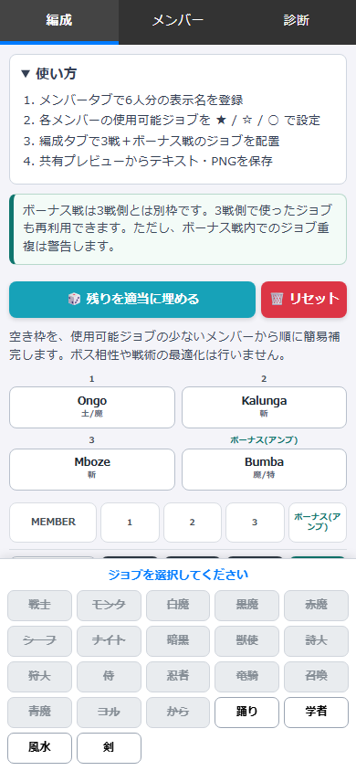

# Gaol Tactician

Gaol Tactician is an unofficial fan-made, mobile-first static web app for planning FFXI Odyssey Gaol 3-battle job assignments.

## 概要

Gaol Tactician は、FFXI のシェオル ジェール向けに、3連戦とボーナス戦のジョブ編成を手入力で整理する非公式メモツールです。

- メンバーごとの使用可能ジョブを ★ / ☆ / ○ / - で管理
- 3連戦側のジョブ重複をチェック
- 4戦目相当のボーナス戦メモ欄を用意
- テキスト・PNG・JSONで保存可能
- すべてブラウザ内で動作し、ゲームクライアントとは連携しません



Public URL:

```text
https://decimal6502.github.io/gaol/
```

## Features

- Register display names for up to 6 planning slots.
- Record each display name's usable jobs.
- Plan 3 Odyssey Gaol battles plus a bonus battle memo column.
- Detect duplicate job usage across the 3 main battles.
- Preview the current plan as text and copy it to the clipboard.
- Preview the current plan as a battle table image and download it as PNG.
- Export/import a JSON backup manually.
- Store editable data in `localStorage` only.

## How to use

1. Open the app.
2. Add display names in the member tab.
3. Mark job availability for each display name.
4. Select display names and jobs on the planning board.
5. Use the sharing panel to copy text, download PNG, or export/import JSON backup.

Tap a job in the Members tab to cycle `Unavailable -> ★ -> ☆ -> ○ -> Unavailable`.

The bonus fight is separate from the 3 main fights. Jobs used in the 3 fights can be reused there, but duplicates within the bonus fight are warned.

The fill button is a simple helper: it fills empty main-fight slots from members with fewer usable jobs first. It does not optimize boss matchups or strategy.

Text and PNG exports use anonymous labels by default. Enable display names only when you intentionally want them included.

## Privacy summary

The app has no backend and does not send member data, plan data, backup data, text exports, or generated images to a developer server. Editable data is stored in your browser's `localStorage`.

JSON backups may include display names, job availability data, plans, and app settings. Store backup files only in trusted locations and do not enter real names or contact information.

See [PRIVACY.md](./PRIVACY.md) for details.

## PWA and home screen

The app is a static GitHub Pages site and can be bookmarked or added to the home screen when your browser supports it. No login, backend, or external sync is required.

## Local development

No build step is required. Open `index.html` directly, or serve the repository root with any local static server:

```bash
python -m http.server 8000
```

Then open:

```text
http://localhost:8000/
```

For GitHub Pages-style path checks, serve the parent directory and open a `/gaol/` path, or verify after publishing at the public URL.

Run the smoke test:

```bash
npm install
npm test
```

The smoke test serves the app under a local `/gaol/` path and checks page load, CSS/JS loading, clipboard copy, PNG download, JSON export/import, diagnostics text, and 390px mobile width.

## Disclaimer

This is an unofficial fan-made tool. It is not affiliated with, endorsed by, sponsored by, or approved by SQUARE ENIX.

No official FFXI images, icons, logos, screenshots, or other official assets are used.

This app does not interact with FINAL FANTASY XI, PlayOnline, Windower, Ashita, or the game client. It does not read memory, packets, logs, screenshots, game files, or account information.

This app does not automate gameplay, substitute player input, modify the game client, or display an in-game overlay. All information is entered manually by the user and stored in the browser.
